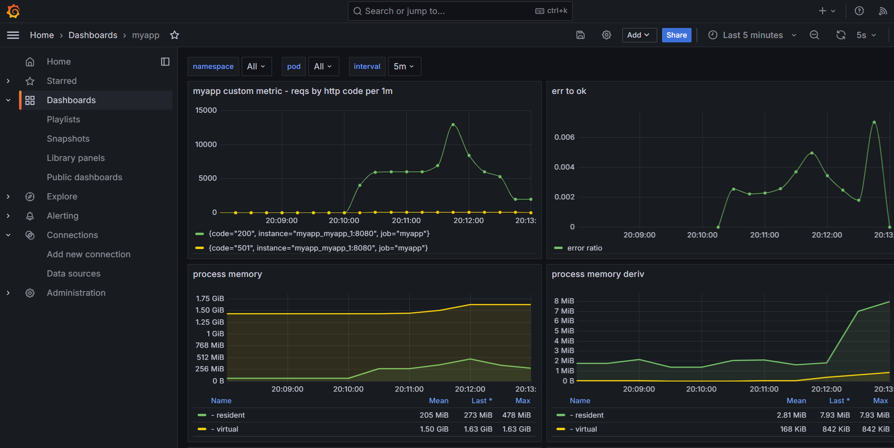

# myapp

Placeholder app to demo metrics instrumentation.

## Changelogs

See [here](./docs/CHANGELOG.md)

## Requirements

- Go - check the `go.mod` file for versions
- Podman or Docker with compose

Optional:

- [direnv.net](https://github.com/direnv/direnv) - autom. loads environment variables 
- [git-cliff.org](https://github.com/orhun/git-cliff) - to generate the changelogs
- [just.systems](https://github.com/casey/just) - convenience tool to run commands
- [vegeta](https://github.com/tsenart/vegeta) - for synthetic load testing

## Usage

Copy `.env.sample` to `.env` and adjust the values as needed. If `direnv` is
not available, add `export ` in front of all environment variables and source
the `.env` file in your shell instead.

Then run:

`just up`
