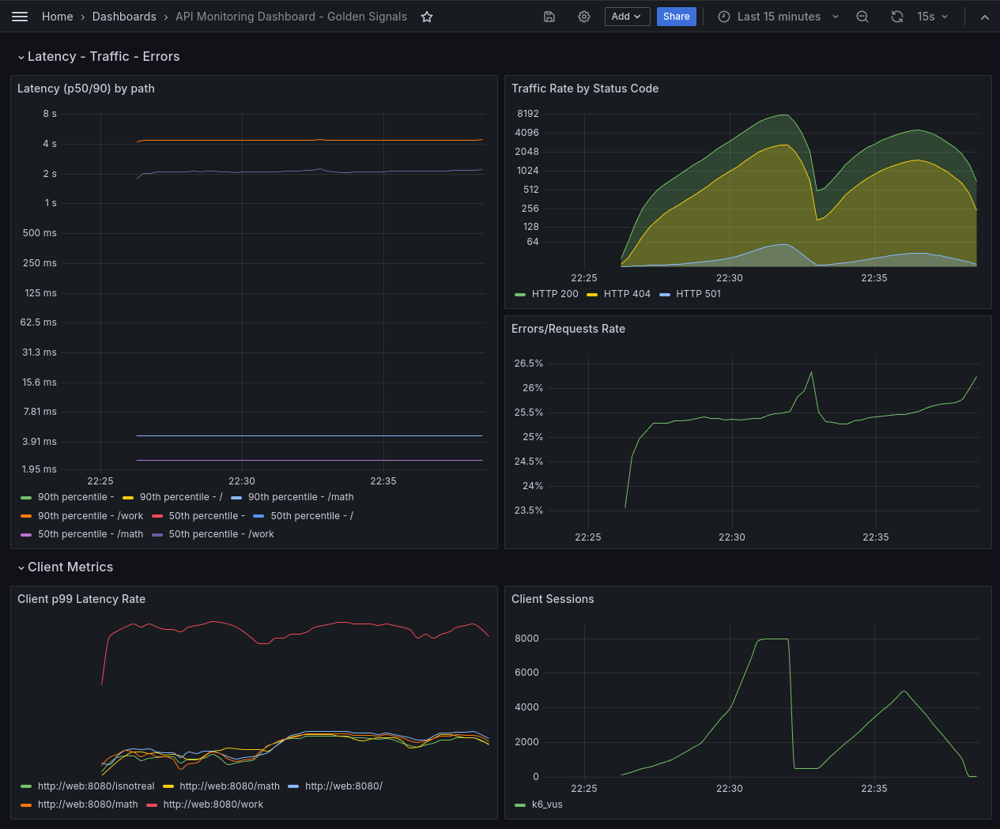

# myapp

Placeholder app to demo metrics instrumentation.

## Changelogs

See [here](./docs/CHANGELOG.md)

## Requirements

- Go - check the `go.mod` file for versions
- Podman or Docker with compose

Optional:

- [direnv.net](https://github.com/direnv/direnv) - autom. loads environment variables 
- [git-cliff.org](https://github.com/orhun/git-cliff) - to generate the changelogs
- [just.systems](https://github.com/casey/just) - convenience tool to run commands
- [k6](https://github.com/grafana/k6) - for synthetic load testing

## Usage

If `direnv` is not installed/active, source the `.env.sample` file in your
shell.
If you wish to change the defaults, copy the `.env.sample` file to `.env`
and edit it accordingly.

Then run:

`just up`
